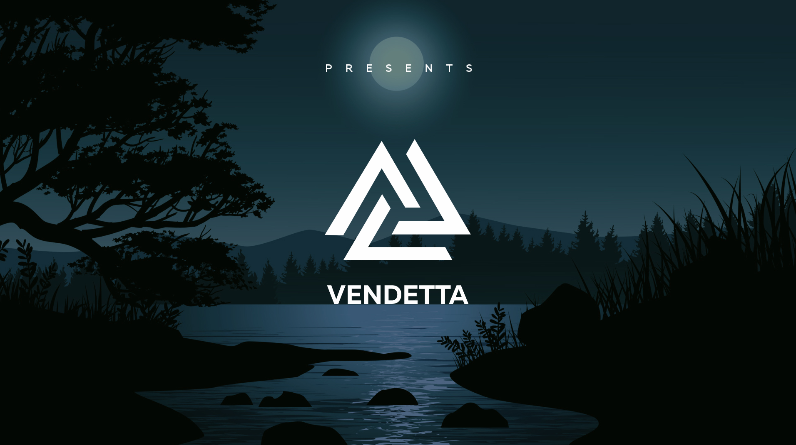
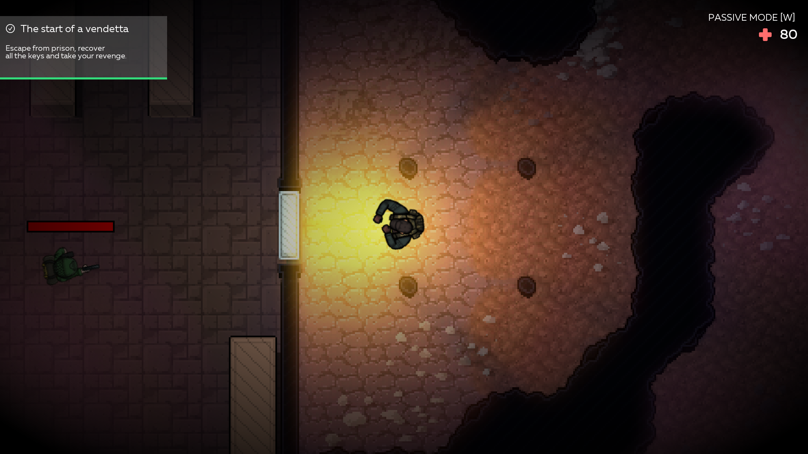
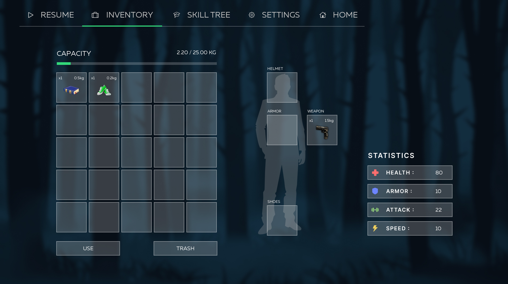
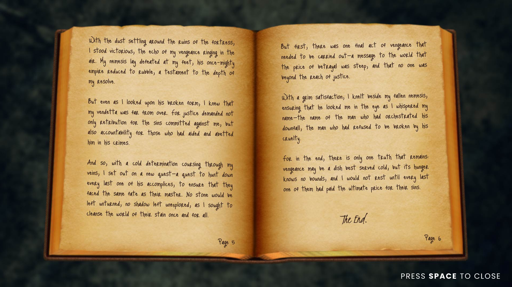
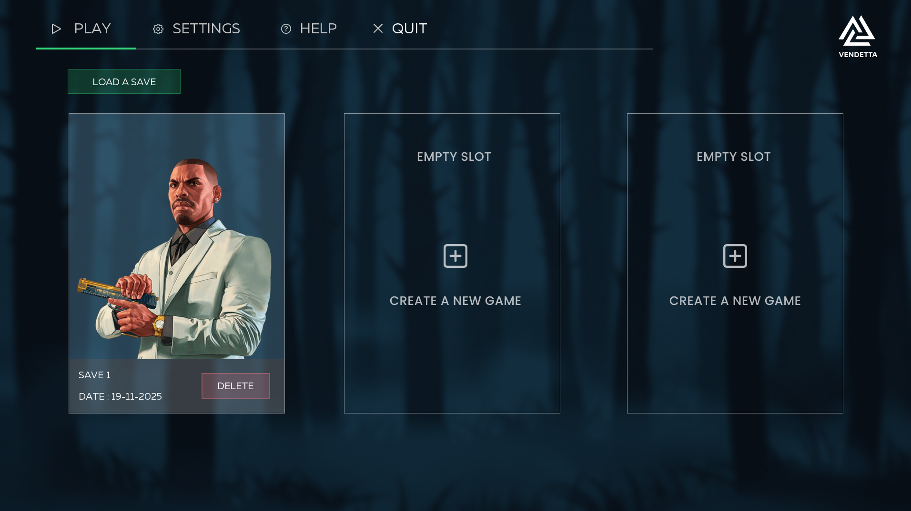

<div align="center">

# 🎮 Vendetta

### *An Epic 2D RPG Adventure*

[](https://www.open-std.org/jtc1/sc22/wg14/)
[](https://www.sfml-dev.org/)
[](LICENSE)
[](https://www.epitech.eu/)

*Explore a mysterious world, battle enemies, unlock skills, and uncover secrets in this immersive role-playing experience.*

[Features](#-features) • [Screenshots](#-screenshots) • [Installation](#-installation) • [Controls](#-controls)

</div>

---

## ✨ Features

- **🗺️ Open World Exploration** - Navigate through richly detailed maps with dynamic collision detection
- **⚔️ Real-time Combat** - Engage enemies with a fluid combat system and projectile mechanics
- **🎒 Inventory System** - Manage items with drag-and-drop functionality
- **🌳 Skill Tree** - Unlock and upgrade abilities to customize your playstyle
- **💬 NPC Dialogues** - Interactive conversations with branching dialogue trees
- **🎮 Mini-games** - Test your reflexes with built-in challenges
- **💾 Save System** - Three save slots with integrity protection
- **🎨 Custom Shaders** - Dynamic visual effects powered by GLSL
- **🎵 Immersive Audio** - Original soundtrack and sound effects

---

## 📸 Screenshots

<div align="center">

### Main Menu


### Gameplay


### Inventory Management


### Interactive Books


### Settings & Configuration


</div>

---

## 🚀 Installation

### Prerequisites

Ensure you have the following installed on your system:

- **GCC** (GNU Compiler Collection)
- **Make**
- **CSFML** (C bindings for SFML)
  ```bash
  # Debian/Ubuntu
  sudo apt-get install libcsfml-dev

  # Fedora
  sudo dnf install CSFML-devel

  # macOS (via Homebrew)
  brew install csfml
  ```

### Build Instructions

```bash
# Clone the repository
git clone https://github.com/yourusername/Vendetta.git
cd Vendetta

# Build the project
make

# Run the game
./my_rpg
```

### Additional Commands

```bash
make clean      # Clean build artifacts
make fclean     # Full clean (including binary)
make re         # Rebuild from scratch
make debug      # Build with debug symbols
./my_rpg -h     # Display help
```

---

## 🎮 Controls

| Action | Key |
|--------|-----|
| Move Up | `Z` or `↑` |
| Move Down | `S` or `↓` |
| Move Left | `Q` or `←` |
| Move Right | `D` or `→` |
| Interact | `E` |
| Attack | `Space` |
| Inventory | `I` |
| Skill Tree | `K` |
| Pause | `Escape` |

*Controls can be customized in the settings menu*

---

## 🏗️ Architecture

Vendetta is built using a **state-based architecture** with the following key components:

- **State Machine** - Clean separation of game states (menu, gameplay, inventory, etc.)
- **Entity System** - Linked list-based entity management for items, enemies, and NPCs
- **Event-driven Input** - Responsive control handling with customizable key bindings
- **Modular Design** - Each system (dialogue, combat, saves) is self-contained

---

## 🛠️ Technologies

- **Language**: C (C99 Standard)
- **Graphics Library**: [CSFML](https://www.sfml-dev.org/) (SFML C bindings)
- **Shaders**: GLSL (OpenGL Shading Language)
- **Build System**: GNU Make
- **Coding Standard**: Epitech Coding Style

---

## 📝 License

This project is licensed under the MIT License - see the [LICENSE](LICENSE) file for details.

---

## 👥 Authors

Made with ❤️ by the Vendetta team as part of the Epitech curriculum.

---

<div align="center">

**[⬆ Back to Top](#-vendetta)**

</div>
